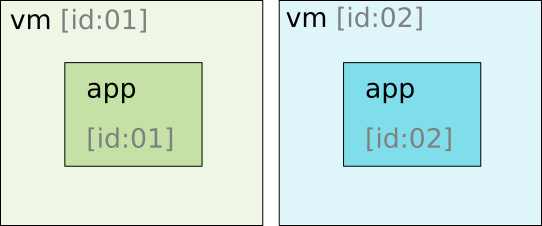

# Overview of Android Apps #
_By Julius Stopforth_

[source](https://developer.android.com/guide/index.html)

## App Fundamentals ##

The `.apk` extension refers to the compiled 'archive' file used to install the
app.

Every app runs in its own virtual machine (VM) that's known as its app sandbox.

These VM processes are self contained and managed by the user account for the
app and the system.

This app's user account is given specialised permissions that the app requests,
but it is not known by the app itself!

You can view it as the app's guardian or wrangler.

So to clarify:
* every app has a user account registered on the underlying Linux system
* this user account owns the vm process within which the app runs
* the app is contained in the vm controlled by both the system and the app user
account

Whenever an app component is started, it activates the app process owned by the
user account. This is shutdown when no longer needed or by the system when it
needs to recover memory.

## Principle of Least Priviledge ##

The user account is the thing that is given or denied permissions. For example,
if your app wants access to the camera, the user account is granted those
permissions by the system which then lets the app access the camera.

The _'Principle of Least Priviledge'_ basically means that an app only has
access to the base minimum it needs to work and no more!

These permissions are specified in the `AndroidManifest.xml` and is used to
grant the app permissions either at install time or run-time.

## Sharing data between apps? ##

Because of how the Android system works, there are two ways to share data
between two different apps: the hard(er) way and the easy way.

### The harder way ###
* apps share a user account (id)
* same user account means same vm process

How: both apps must be signed using the same certificate

### The easy way ###
* apps have different user accounts
* simpler ad-hoc sharing

How: requesting permissions from the app user account

Next: App components
